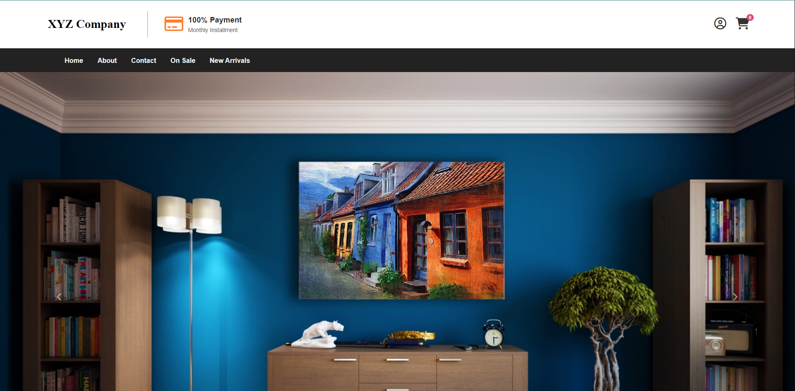
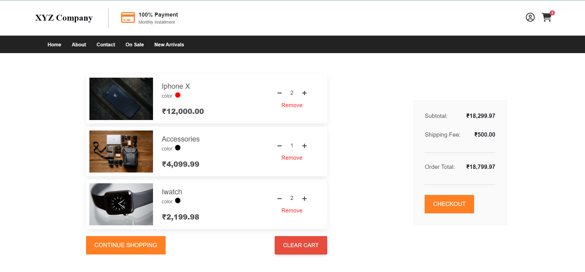
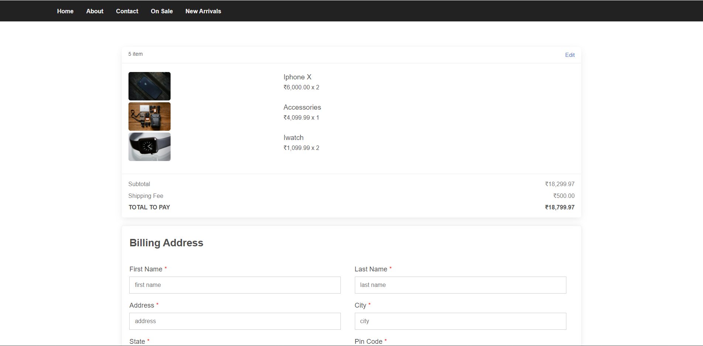
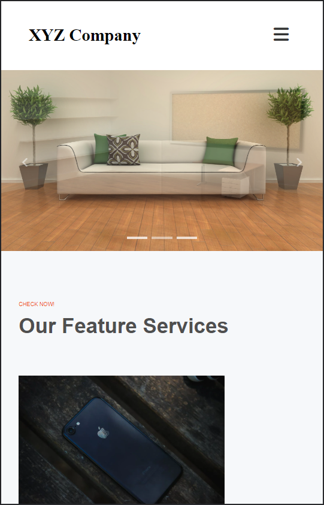

# Totality Frontend Challenge

### E-Commerce Shopping Site Challenge

This Challenge is completed using ReactJS, React-Router and React-Bootstrap. The challenge was to create a shopping site that allows users to add items to a cart, remove items from a cart, and checkout. The site also allows users to filter items by category and search for items by name. The site is also responsive and mobile friendly.

## Installation

To install this project, clone the repository and run `npm install` to install the dependencies. Then run `npm start` to start the project. The project will be running on `localhost:3000`.

## Features

- Users can add items to a cart
- Users can remove items from a cart
- Users can increase/decrease items from cart
- Users can checkout
- Users can filter items by category
- Users can filter items by price range
- Users can search for items by name
- Site is responsive and mobile friendly

## Test Login

- Username: test@test.com
- Password: Test@12345

## Screenshots

### Home Page

### Cart Page

### Checkout Page

### Mobile View

## Future Improvements

- Add a backend to store user information and cart information
- Add a login page
- Add a user profile page
- Add a page to view past orders
- Add a page to view order details
- Add a page to view order status
- Add a page to view order tracking
- Add a page to view order history

## License

[MIT](https://choosealicense.com/licenses/mit/)
